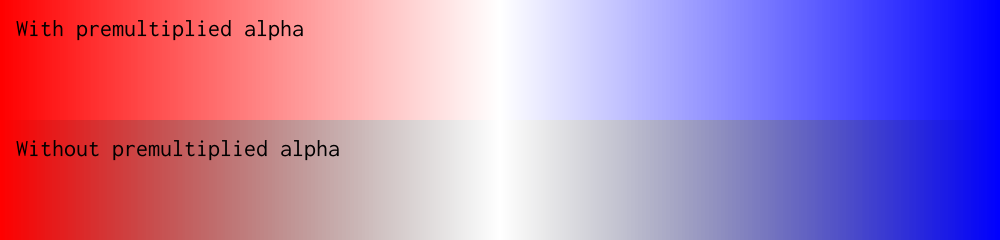

#  Unicolour
[](https://gitlab.com/Wacton/Unicolour/-/commits/main)
[](https://gitlab.com/Wacton/Unicolour/-/pipelines)
[](https://gitlab.com/Wacton/Unicolour/-/pipelines)
[](https://www.nuget.org/packages/Wacton.Unicolour/)

Unicolour is a .NET library written in C# for working with colour:
- Colour space conversion
- Colour mixing / colour interpolation
- Colour comparison
- Colour properties
- Colour gamut mapping

## Overview 🧭
A `Unicolour` encapsulates a single colour and its representation across different colour spaces. It supports:
- RGB
- Linear RGB
- HSB/HSV
- HSL
- HWB
- CIEXYZ
- CIExyY
- CIELAB
- CIELCh<sub>ab</sub>
- CIELUV
- CIELCh<sub>uv</sub>
- HSLuv
- HPLuv
- IC<sub>T</sub>C<sub>P</sub>
- J<sub>z</sub>a<sub>z</sub>b<sub>z</sub>
- J<sub>z</sub>C<sub>z</sub>h<sub>z</sub>
- Oklab
- Oklch
- CIECAM02
- CAM16
- HCT

<details>
<summary>Diagram of colour space relationships</summary>


This diagram summarises how colour space conversions are implemented in Unicolour.
Arrows indicate forward transformations from one space to another.
For each forward transformation there is a corresponding reverse transformation.
XYZ is considered the root colour space.
</details>

The following colour properties are available on each `Unicolour`:
- Hex representation
- Relative luminance
- Temperature (CCT and Duv)

Unicolour can be used to calculate colour difference via:
- ΔE<sub>76</sub> (CIE76)
- ΔE<sub>94</sub> (CIE94)
- ΔE<sub>00</sub> (CIEDE2000)
- ΔE<sub>CMC</sub> (CMC l:c)
- ΔE<sub>ITP</sub>
- ΔE<sub>z</sub>
- ΔE<sub>HyAB</sub>
- ΔE<sub>OK</sub>
- ΔE<sub>CAM02</sub>
- ΔE<sub>CAM16</sub>

Simulation of colour vision deficiency (CVD) / colour blindness is supported for:
- Protanopia (no red perception)
- Deuteranopia (no green perception)
- Tritanopia (no blue perception)
- Achromatopsia (no colour perception)

If a colour is outwith the display gamut, the closest in-gamut colour can be obtained using the provided
gamut mapping algorithm, which meets CSS specifications.

Unicolour uses sRGB as the default RGB model and standard illuminant D65 (2° observer) as the default white point of the XYZ colour space.
These [can be overridden](#advanced-configuration-) using the `Configuration` parameter.

This library was initially written for personal projects since existing libraries had complex APIs or missing features.
The goal of this library is to be accurate, intuitive, and easy to use.
Although performance is not a priority, conversions are only calculated once; when first evaluated (either on access or as part of an intermediate conversion step) the result is stored for future use.
It is also [extensively tested](Unicolour.Tests), including verification of roundtrip conversions, validation using known colour values, and 100% line coverage and branch coverage.

Targets [.NET Standard 2.0](https://docs.microsoft.com/en-us/dotnet/standard/net-standard?tabs=net-standard-2-0) for use in .NET 5.0+, .NET Core 2.0+ and .NET Framework 4.6.1+ applications.

## Quickstart ⚡
| Colour space                            | Enum                    | Create                            | Get            |
|-----------------------------------------|-------------------------|-----------------------------------|----------------|
| RGB (Hex)                               | -                       | `new(hex)`                        | `.Hex`         |
| RGB (0-255)                             | `ColourSpace.Rgb255`    | `new(ColourSpace.Rgb255, ...)`    | `.Rgb.Byte255` |
| RGB                                     | `ColourSpace.Rgb`       | `new(ColourSpace.Rgb, ...)`       | `.Rgb`         |
| Linear RGB                              | `ColourSpace.RgbLinear` | `new(ColourSpace.RgbLinear, ...)` | `.RgbLinear`   |
| HSB/HSV                                 | `ColourSpace.Hsb`       | `new(ColourSpace.Hsb, ...)`       | `.Hsb`         |
| HSL                                     | `ColourSpace.Hsl`       | `new(ColourSpace.Hsl, ...)`       | `.Hsl`         |
| HWB                                     | `ColourSpace.Hwb`       | `new(ColourSpace.Hwb, ...)`       | `.Hwb`         |
| CIEXYZ                                  | `ColourSpace.Xyz`       | `new(ColourSpace.Xyz, ...)`       | `.Xyz`         |
| CIExyY                                  | `ColourSpace.Xyy`       | `new(ColourSpace.Xyy, ...)`       | `.Xyy`         |
| CIELAB                                  | `ColourSpace.Lab`       | `new(ColourSpace.Lab, ...)`       | `.Lab`         |
| CIELCh<sub>ab</sub>                     | `ColourSpace.Lchab`     | `new(ColourSpace.Lchab, ...)`     | `.Lchab`       |
| CIELUV                                  | `ColourSpace.Luv`       | `new(ColourSpace.Luv, ...)`       | `.Luv`         |
| CIELCh<sub>uv</sub>                     | `ColourSpace.Lchuv`     | `new(ColourSpace.Lchuv, ...)`     | `.Lchuv`       |
| HSLuv                                   | `ColourSpace.Hsluv`     | `new(ColourSpace.Hsluv, ...)`     | `.Hsluv`       |
| HPLuv                                   | `ColourSpace.Hpluv`     | `new(ColourSpace.Hpluv, ...)`     | `.Hpluv`       |
| IC<sub>T</sub>C<sub>P</sub>             | `ColourSpace.Ictcp`     | `new(ColourSpace.Ictcp, ...)`     | `.Ictcp`       |
| J<sub>z</sub>a<sub>z</sub>b<sub>z</sub> | `ColourSpace.Jzazbz`    | `new(ColourSpace.Jzazbz, ...)`    | `.Jzazbz`      |
| J<sub>z</sub>C<sub>z</sub>h<sub>z</sub> | `ColourSpace.Jzczhz`    | `new(ColourSpace.Jzczhz, ...)`    | `.Jzczhz`      |
| Oklab                                   | `ColourSpace.Oklab`     | `new(ColourSpace.Oklab, ...)`     | `.Oklab`       |
| Oklch                                   | `ColourSpace.Oklch`     | `new(ColourSpace.Oklch, ...)`     | `.Oklch`       |
| CIECAM02                                | `ColourSpace.Cam02`     | `new(ColourSpace.Cam02, ...)`     | `.Cam02`       |
| CAM16                                   | `ColourSpace.Cam16`     | `new(ColourSpace.Cam16, ...)`     | `.Cam16`       |
| HCT                                     | `ColourSpace.Hct`       | `new(ColourSpace.Hct, ...)`       | `.Hct`         |

## How to use 🌈
1. Install the package from [NuGet](https://www.nuget.org/packages/Wacton.Unicolour/)
```
dotnet add package Wacton.Unicolour
```

2. Import the package
```c#
using Wacton.Unicolour;
```

3. Create a `Unicolour`
```c#
var unicolour = new Unicolour("#FF1493");
var unicolour = new Unicolour(ColourSpace.Rgb255, 255, 20, 147);
var unicolour = new Unicolour(ColourSpace.Rgb, 1.00, 0.08, 0.58);
var unicolour = new Unicolour(ColourSpace.RgbLinear, 1.00, 0.01, 0.29);
var unicolour = new Unicolour(ColourSpace.Hsb, 327.6, 0.922, 1.000);
var unicolour = new Unicolour(ColourSpace.Hsl, 327.6, 1.000, 0.539);
var unicolour = new Unicolour(ColourSpace.Hwb, 327.6, 0.078, 0.000);
var unicolour = new Unicolour(ColourSpace.Xyz, 0.4676, 0.2387, 0.2974);
var unicolour = new Unicolour(ColourSpace.Xyy, 0.4658, 0.2378, 0.2387);
var unicolour = new Unicolour(ColourSpace.Lab, 55.96, 84.54, -5.7);
var unicolour = new Unicolour(ColourSpace.Lchab, 55.96, 84.73, 356.1);
var unicolour = new Unicolour(ColourSpace.Luv, 55.96, 131.47, -24.35);
var unicolour = new Unicolour(ColourSpace.Lchuv, 55.96, 133.71, 349.5);
var unicolour = new Unicolour(ColourSpace.Hsluv, 349.5, 100.0, 56.0);
var unicolour = new Unicolour(ColourSpace.Hpluv, 349.5, 303.2, 56.0);
var unicolour = new Unicolour(ColourSpace.Ictcp, 0.38, 0.12, 0.19);
var unicolour = new Unicolour(ColourSpace.Jzazbz, 0.106, 0.107, 0.005);
var unicolour = new Unicolour(ColourSpace.Jzczhz, 0.106, 0.107, 2.6);
var unicolour = new Unicolour(ColourSpace.Oklab, 0.65, 0.26, -0.01);
var unicolour = new Unicolour(ColourSpace.Oklch, 0.65, 0.26, 356.9);
var unicolour = new Unicolour(ColourSpace.Cam02, 62.86, 40.81, -1.18);
var unicolour = new Unicolour(ColourSpace.Cam16, 62.47, 42.60, -1.36);
var unicolour = new Unicolour(ColourSpace.Hct, 358.2, 100.38, 55.96);
```

4. Get colour space representations
```c#
var rgb = unicolour.Rgb;
var rgbLinear = unicolour.RgbLinear;
var hsb = unicolour.Hsb;
var hsl = unicolour.Hsl;
var hwb = unicolour.Hwb;
var xyz = unicolour.Xyz;
var xyy = unicolour.Xyy;
var lab = unicolour.Lab;
var lchab = unicolour.Lchab;
var luv = unicolour.Luv;
var lchuv = unicolour.Lchuv;
var hsluv = unicolour.Hsluv;
var hpluv = unicolour.Hpluv;
var ictcp = unicolour.Ictcp;
var jzazbz = unicolour.Jzazbz;
var jzczhz = unicolour.Jzczhz;
var oklab = unicolour.Oklab;
var oklch = unicolour.Oklch;
var cam02 = unicolour.Cam02;
var cam16 = unicolour.Cam16;
var hct = unicolour.Hct;
```

5. Get colour properties
```c#
var hex = unicolour.Hex;
var relativeLuminance = unicolour.RelativeLuminance;
var temperature = unicolour.Temperature;
var inGamut = unicolour.IsInDisplayGamut;
```

6. Mix colours (interpolate between them)
```c#
var mixed = unicolour1.Mix(ColourSpace.Rgb, unicolour2);
var mixed = unicolour1.Mix(ColourSpace.RgbLinear, unicolour2);
var mixed = unicolour1.Mix(ColourSpace.Hsb, unicolour2);
var mixed = unicolour1.Mix(ColourSpace.Hsl, unicolour2);
var mixed = unicolour1.Mix(ColourSpace.Hwb, unicolour2);
var mixed = unicolour1.Mix(ColourSpace.Xyz, unicolour2);
var mixed = unicolour1.Mix(ColourSpace.Xyy, unicolour2);
var mixed = unicolour1.Mix(ColourSpace.Lab, unicolour2);
var mixed = unicolour1.Mix(ColourSpace.Lchab, unicolour2);
var mixed = unicolour1.Mix(ColourSpace.Luv, unicolour2);
var mixed = unicolour1.Mix(ColourSpace.Lchuv, unicolour2);
var mixed = unicolour1.Mix(ColourSpace.Hsluv, unicolour2);
var mixed = unicolour1.Mix(ColourSpace.Hpluv, unicolour2);
var mixed = unicolour1.Mix(ColourSpace.Ictcp, unicolour2);
var mixed = unicolour1.Mix(ColourSpace.Jzazbz, unicolour2);
var mixed = unicolour1.Mix(ColourSpace.Jzczhz, unicolour2);
var mixed = unicolour1.Mix(ColourSpace.Oklab, unicolour2);
var mixed = unicolour1.Mix(ColourSpace.Oklch, unicolour2);
var mixed = unicolour1.Mix(ColourSpace.Cam02, unicolour2);
var mixed = unicolour1.Mix(ColourSpace.Cam16, unicolour2);
var mixed = unicolour1.Mix(ColourSpace.Hct, unicolour2);
```

7. Compare colours
```c#
var contrast = unicolour1.Contrast(unicolour2);
var difference = unicolour1.Difference(DeltaE.Cie76, unicolour2);
var difference = unicolour1.Difference(DeltaE.Cie94, unicolour2);
var difference = unicolour1.Difference(DeltaE.Cie94Textiles, unicolour2);
var difference = unicolour1.Difference(DeltaE.Ciede2000, unicolour2);
var difference = unicolour1.Difference(DeltaE.CmcAcceptability, unicolour2);
var difference = unicolour1.Difference(DeltaE.CmcPerceptibility, unicolour2);
var difference = unicolour1.Difference(DeltaE.Itp, unicolour2);
var difference = unicolour1.Difference(DeltaE.Z, unicolour2);
var difference = unicolour1.Difference(DeltaE.Hyab, unicolour2);
var difference = unicolour1.Difference(DeltaE.Ok, unicolour2);
var difference = unicolour1.Difference(DeltaE.Cam02, unicolour2);
var difference = unicolour1.Difference(DeltaE.Cam16, unicolour2);
```

8. Map colour to display gamut
```c#
var mapped = unicolour.MapToGamut();
```

9. Simulate colour vision deficiency
```c#
var protanopia = unicolour.SimulateProtanopia();
var deuteranopia = unicolour.SimulateDeuteranopia();
var tritanopia = unicolour.SimulateTritanopia();
var achromatopsia = unicolour.SimulateAchromatopsia();
```

## Examples ✨

This repo contains an [example project](Unicolour.Example/Program.cs) that uses `Unicolour` to:
1. Generate gradients through different colour spaces
2. Render the colour spectrum with different colour vision deficiencies
3. Demonstrate interpolation with and without premultiplied alpha




There is also a [console application](Unicolour.Console/Program.cs) that uses `Unicolour` to show colour information for a given hex value:


## Advanced configuration 💡
A `Configuration` parameter can be used to customise the RGB model (e.g. Display P3, Rec. 2020)
and the white point of the XYZ colour space (e.g. D50 reference white used by ICC profiles).

- RGB configuration requires red, green, and blue chromaticity coordinates, the reference white point, and the companding functions.
  Default configuration for sRGB, Display P3, and Rec. 2020 is provided.

- XYZ configuration only requires the reference white point.
  Default configuration for D65 and D50 (2° observer) is provided.

```c#
// built-in configuration for Rec. 2020 RGB + D65 XYZ
var config = new Configuration(RgbConfiguration.Rec2020, XyzConfiguration.D65);
var unicolour = new Unicolour(ColourSpace.Rgb255, config, 255, 20, 147);
```

```c#
// manual configuration for wide-gamut RGB
var rgbConfig = new RgbConfiguration(
    chromaticityR: new(0.7347, 0.2653),
    chromaticityG: new(0.1152, 0.8264),
    chromaticityB: new(0.1566, 0.0177),
    whitePoint: WhitePoint.From(Illuminant.D50),
    fromLinear: value => Companding.Gamma(value, 2.2),
    toLinear: value => Companding.InverseGamma(value, 2.2)
);

// manual configuration for equal-energy (10° observer) XYZ
var xyzConfig = new XyzConfiguration(
    whitePoint: WhitePoint.From(Illuminant.E, Observer.Supplementary10)
);

var config = new Configuration(rgbConfig, xyzConfig);
var unicolour = new Unicolour(ColourSpace.Rgb255, config, 255, 20, 147);
```

Configuration is also available for CAM02 & CAM16 viewing conditions,
IC<sub>T</sub>C<sub>P</sub> scalar,
and J<sub>z</sub>a<sub>z</sub>b<sub>z</sub> scalar.

A `Unicolour` can be converted to a different configuration, which enables conversions between different RGB and XYZ models.

```c#
// pure sRGB green
var srgbConfig = new Configuration(RgbConfiguration.StandardRgb);
var unicolourSrgb = new Unicolour(ColourSpace.Rgb, srgbConfig, 0, 1, 0);                         
Console.WriteLine(unicolourSrgb.Rgb); // 0.00 1.00 0.00

// pure sRGB green -> Display P3
var displayP3Config = new Configuration(RgbConfiguration.DisplayP3);
var unicolourDisplayP3 = unicolourSrgb.ConvertToConfiguration(displayP3Config); 
Console.WriteLine(unicolourDisplayP3.Rgb); // 0.46 0.99 0.30

// pure sRGB green -> Rec. 2020
var rec202Config = new Configuration(RgbConfiguration.Rec2020);
var unicolourRec2020 = unicolourDisplayP3.ConvertToConfiguration(rec202Config);
Console.WriteLine(unicolourRec2020.Rgb); // 0.57 0.96 0.27
```

---

[Wacton.Unicolour](https://github.com/waacton/Unicolour) is licensed under the [MIT License](https://choosealicense.com/licenses/mit/), copyright © 2022-2023 William Acton.
