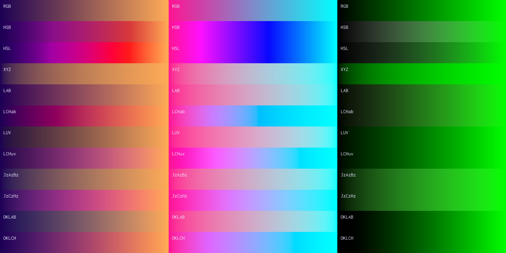

#  Unicolour
[](https://gitlab.com/Wacton/Unicolour/-/commits/main)
[](https://gitlab.com/Wacton/Unicolour/-/pipelines)
[](https://gitlab.com/Wacton/Unicolour/-/pipelines)
[](https://www.nuget.org/packages/Wacton.Unicolour/)

Unicolour is a set of utilities for working with colour:
- Colour space conversion
- Colour interpolation
- Colour comparison

A `Unicolour` encapsulates a single colour and its representation across different colour spaces. It supports:
- RGB
- HSB/HSV
- HSL
- HWB
- CIEXYZ
- CIExyY
- CIELAB
- CIELCh<sub>ab</sub>
- CIELUV
- CIELCh<sub>uv</sub>
- HSLuv
- HPLuv
- IC<sub>T</sub>C<sub>P</sub>
- J<sub>z</sub>a<sub>z</sub>b<sub>z</sub>
- J<sub>z</sub>C<sub>z</sub>h<sub>z</sub>
- Oklab
- Oklch

Unicolour can be used to calculate colour difference via:
- ΔE<sub>76</sub> (CIE76)
- ΔE<sub>94</sub> (CIE94)
- ΔE<sub>00</sub> (CIEDE2000)
- ΔE<sub>ITP</sub>
- ΔE<sub>z</sub>
- ΔE<sub>HyAB</sub>

Unicolour uses sRGB as the default RGB model and standard illuminant D65 (2° observer) as the default white point of the XYZ colour space.
These [can be overridden](#advanced-configuration-) using the `Configuration` parameter.

This library was initially written for personal projects since existing libraries had complex APIs or missing features.
The goal of this library is to be accurate, intuitive, and easy to use.
Although performance is not a priority, conversions are only calculated once — when first evaluated (either on access or as part of an intermediate conversion step) the result is stored for future use.
It is also [extensively tested](Unicolour.Tests), including comparisons against known colour values and other .NET libraries.

Targets [.NET Standard 2.0](https://docs.microsoft.com/en-us/dotnet/standard/net-standard?tabs=net-standard-2-0) for use in .NET 5.0+, .NET Core 2.0+ and .NET Framework 4.6.1+ applications.

## Quickstart ⚡
| Colour space                            | Construction             | Access         | Interpolation           |
|-----------------------------------------|--------------------------|----------------|-------------------------|
| RGB (Hex)                               | `Unicolour.FromHex()`    | `.Hex`         | `.InterpolateRgb()`     |
| RGB (0-255)                             | `Unicolour.FromRgb255()` | `.Rgb.Byte255` | `.InterpolateRgb()`     |
| RGB                                     | `Unicolour.FromRgb()`    | `.Rgb`         | `.InterpolateRgb()`     |
| HSB/HSV                                 | `Unicolour.FromHsb()`    | `.Hsb`         | `.InterpolateHsb()`     |
| HSL                                     | `Unicolour.FromHsl()`    | `.Hsl`         | `.InterpolateHsl()`     |
| HWB                                     | `Unicolour.FromHwb()`    | `.Hwb`         | `.InterpolateHwb()`     |
| CIEXYZ                                  | `Unicolour.FromXyz()`    | `.Xyz`         | `.InterpolateXyz()`     |
| CIExyY                                  | `Unicolour.FromXyy()`    | `.Xyy`         | `.InterpolateXyy()`     |
| CIELAB                                  | `Unicolour.FromLab()`    | `.Lab`         | `.InterpolateLab()`     |
| CIELCh<sub>ab</sub>                     | `Unicolour.FromLchab()`  | `.Lchab`       | `.InterpolateLchab()`   |
| CIELUV                                  | `Unicolour.FromLuv()`    | `.Luv`         | `.InterpolateLuv()`     |
| CIELCh<sub>uv</sub>                     | `Unicolour.FromLchuv()`  | `.Lchuv`       | `.InterpolateLchuv()`   |
| HSLuv                                   | `Unicolour.FromHsluv()`  | `.Hsluv`       | `.InterpolateHsluv()`   |
| HPLuv                                   | `Unicolour.FromHpluv()`  | `.Hpluv`       | `.InterpolateHpluv()`   |
| IC<sub>T</sub>C<sub>P</sub>             | `Unicolour.FromIctcp()`  | `.Ictcp`       | `.InterpolateIctcp()`   |
| J<sub>z</sub>a<sub>z</sub>b<sub>z</sub> | `Unicolour.FromJzazbz()` | `.Jzazbz`      | `.InterpolateJzazbz()`  |
| J<sub>z</sub>C<sub>z</sub>h<sub>z</sub> | `Unicolour.FromJzczhz()` | `.Jzczhz`      | `.InterpolateJzczhz()`  |
| Oklab                                   | `Unicolour.FromOklab()`  | `.Oklab`       | `.InterpolateOklab()`   |
| Oklch                                   | `Unicolour.FromOklch()`  | `.Oklch`       | `.InterpolateOklch()`   |

## How to use 🎨
1. Install the package from [NuGet](https://www.nuget.org/packages/Wacton.Unicolour/)
```
dotnet add package Wacton.Unicolour
```

2. Create a `Unicolour` from values:
```c#
using Wacton.Unicolour;
...
var unicolour = Unicolour.FromHex("#FF1493");
var unicolour = Unicolour.FromRgb255(255, 20, 147);
var unicolour = Unicolour.FromRgb(1.0, 0.08, 0.58);
var unicolour = Unicolour.FromHsb(327.6, 0.922, 1.0);
var unicolour = Unicolour.FromHsl(327.6, 1.0, 0.539);
var unicolour = Unicolour.FromHwb(327.6, 0.078, 0.0);
var unicolour = Unicolour.FromXyz(0.4676, 0.2387, 0.2974);
var unicolour = Unicolour.FromXyy(0.4658, 0.2378, 0.2387);
var unicolour = Unicolour.FromLab(55.96, +84.54, -5.7);
var unicolour = Unicolour.FromLchab(55.96, 84.73, 356.1);
var unicolour = Unicolour.FromLuv(55.96, +131.47, -24.35);
var unicolour = Unicolour.FromLchuv(55.96, 133.71, 349.5);
var unicolour = Unicolour.FromHsluv(349.5, 100, 56);
var unicolour = Unicolour.FromHpluv(349.5, 303.2, 56);
var unicolour = Unicolour.FromIctcp(0.38, +0.12, +0.19);
var unicolour = Unicolour.FromJzazbz(0.106, +0.107, +0.005);
var unicolour = Unicolour.FromJzczhz(0.106, 0.107, 2.6);
var unicolour = Unicolour.FromOklab(0.65, 0.26, -0.01);
var unicolour = Unicolour.FromOklch(0.65, 0.26, 356.9);
```

3. Get representation of colour in different colour spaces:
```c#
var rgb = unicolour.Rgb;
var hsb = unicolour.Hsb;
var hsl = unicolour.Hsl;
var hwb = unicolour.Hwb;
var xyz = unicolour.Xyz;
var xyy = unicolour.Xyy;
var lab = unicolour.Lab;
var lchab = unicolour.Lchab;
var luv = unicolour.Luv;
var lchuv = unicolour.Lchuv;
var hsluv = unicolour.Hsluv;
var hpluv = unicolour.Hpluv;
var ictcp = unicolour.Ictcp;
var jzazbz = unicolour.Jzazbz;
var jzczhz = unicolour.Jzczhz;
var oklab = unicolour.Oklab;
var oklch = unicolour.Oklch;
```

4. Interpolate between colours:
```c#
var interpolated = unicolour1.InterpolateRgb(unicolour2, 0.5);
var interpolated = unicolour1.InterpolateHsb(unicolour2, 0.5);
var interpolated = unicolour1.InterpolateHsl(unicolour2, 0.5);
var interpolated = unicolour1.InterpolateHwb(unicolour2, 0.5);
var interpolated = unicolour1.InterpolateXyz(unicolour2, 0.5);
var interpolated = unicolour1.InterpolateXyy(unicolour2, 0.5);
var interpolated = unicolour1.InterpolateLab(unicolour2, 0.5);
var interpolated = unicolour1.InterpolateLchab(unicolour2, 0.5);
var interpolated = unicolour1.InterpolateLuv(unicolour2, 0.5);
var interpolated = unicolour1.InterpolateLchuv(unicolour2, 0.5);
var interpolated = unicolour1.InterpolateHsluv(unicolour2, 0.5);
var interpolated = unicolour1.InterpolateHpluv(unicolour2, 0.5);
var interpolated = unicolour1.InterpolateIctcp(unicolour2, 0.5);
var interpolated = unicolour1.InterpolateJzazbz(unicolour2, 0.5);
var interpolated = unicolour1.InterpolateJzczhz(unicolour2, 0.5);
var interpolated = unicolour1.InterpolateOklab(unicolour2, 0.5);
var interpolated = unicolour1.InterpolateOklch(unicolour2, 0.5);
```

5. Compare colours:
```c#
var contrast = unicolour1.Contrast(unicolour2);
var difference = unicolour1.DeltaE76(unicolour2);
var difference = unicolour1.DeltaE94(unicolour2);
var difference = unicolour1.DeltaE00(unicolour2);
var difference = unicolour1.DeltaEItp(unicolour2);
var difference = unicolour1.DeltaEz(unicolour2);
var difference = unicolour1.DeltaEHyab(unicolour2);
```

See also the [example code](Unicolour.Example/Program.cs), which uses `Unicolour` to generate gradients through different colour spaces:


## Advanced configuration 💡
A `Configuration` parameter can be used to change the RGB model (e.g. Display P3, Rec. 2020)
and the white point of the XYZ colour space (e.g. D50 reference white used by ICC profiles).

RGB configuration requires red, green, and blue chromaticity coordinates, the reference white point, and the companding functions.
Default configuration for sRGB, Display P3, and Rec. 2020 is provided.

XYZ configuration only requires the reference white point.
Default configuration for D65 and D50 (2° observer) is provided.

```c#
// built-in configuration for Rec. 2020 RGB + D65 XYZ
var config = new Configuration(RgbConfiguration.Rec2020, XyzConfiguration.D65);
var unicolour = Unicolour.FromRgb(config, 255, 20, 147);
```

```c#
// manual configuration for wide-gamut RGB
var rgbConfig = new RgbConfiguration(
    chromaticityR: new(0.7347, 0.2653),
    chromaticityG: new(0.1152, 0.8264),
    chromaticityB: new(0.1566, 0.0177),
    whitePoint: WhitePoint.From(Illuminant.D50),
    fromLinear: value => Companding.Gamma(value, 2.2),
    toLinear: value => Companding.InverseGamma(value, 2.2),
);

// manual configuration for equal-energy (10° observer) XYZ
var xyzConfig = new XyzConfiguration(
    whitePoint: WhitePoint.From(Illuminant.E, Observer.Supplementary10)
);

var config = new Configuration(rgbConfig, xyzConfig);
var unicolour = Unicolour.FromRgb(config, 255, 20, 147);
```

---

[Wacton.Unicolour](https://gitlab.com/Wacton/Unicolour) is licensed under the [MIT License](https://choosealicense.com/licenses/mit/), copyright © 2022-2023 William Acton.
