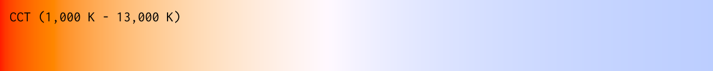

#  Unicolour
[](https://gitlab.com/Wacton/Unicolour/-/commits/main)
[](https://gitlab.com/Wacton/Unicolour/-/pipelines)
[](https://gitlab.com/Wacton/Unicolour/-/pipelines)
[](https://www.nuget.org/packages/Wacton.Unicolour/)

Unicolour is a .NET library written in C# for working with colour:
- Colour space conversion
- Colour mixing / colour interpolation
- Colour difference / colour distance
- Colour temperature
- Colour gamut mapping

Targets [.NET Standard 2.0](https://docs.microsoft.com/en-us/dotnet/standard/net-standard?tabs=net-standard-2-0) for use in .NET 5.0+, .NET Core 2.0+ and .NET Framework 4.6.1+ applications.

**Contents**
1. 🧭 [Overview](#-overview)
2. 🔆 [Installation](#-installation)
3. ⚡ [Quickstart](#-quickstart)
4. 🌈 [Features](#-features)
5. 💡 [Configuration](#-configuration)
6. ✨ [Examples](#-examples)
7. 🔮 [Datasets](#-datasets)

## 🧭 Overview
A `Unicolour` encapsulates a single colour and its representation across [different colour spaces](#convert-between-colour-spaces).
It can also be used to [mix and compare colours](#mix-colours), as well as a [variety of other useful functionality](#-features).

> **Supported colour spaces**
>
> RGB · Linear RGB · HSB/HSV · HSL · HWB · 
> CIEXYZ · CIExyY · CIELAB · CIELCh<sub>ab</sub> · CIELUV · CIELCh<sub>uv</sub> · HSLuv · HPLuv · 
> IC<sub>T</sub>C<sub>P</sub> · J<sub>z</sub>a<sub>z</sub>b<sub>z</sub> · J<sub>z</sub>C<sub>z</sub>h<sub>z</sub> · 
> Oklab · Oklch · 
> CIECAM02 · CAM16 · 
> HCT
> ```c#
> Unicolour pink = new("#FF1493");
> Console.WriteLine(pink.Oklab); // 0.65 +0.26 -0.01
> ```

This library was initially written for personal projects since existing libraries had complex APIs, missing features, or inaccurate conversions.
The goal of this library is to be [accurate, intuitive, and easy to use](#-quickstart).
Although performance is not a priority, conversions are only calculated once; when first evaluated (either on access or as part of an intermediate conversion step) the result is stored for future use.

Unicolour also [extensively tested](Unicolour.Tests), including verification of roundtrip conversions, validation using known colour values, and 100% line coverage and branch coverage.

## 🔆 Installation
1. Install the package from [NuGet](https://www.nuget.org/packages/Wacton.Unicolour/)
```
dotnet add package Wacton.Unicolour
```

2. Import the package
```c#
using Wacton.Unicolour;
```

3. Use the package
```c#
Unicolour colour = new(ColourSpace.Rgb255, 192, 255, 238);
```

## ⚡ Quickstart
The simplest way to get started is to make a `Unicolour` and use it to see how the colour is [represented in a different colour space](#convert-between-colour-spaces).
```c#
var cyan = new Unicolour("#00FFFF");
Console.WriteLine(cyan.Hsl); // 180.0° 100.0% 50.0%

var yellow = new Unicolour(ColourSpace.Rgb255, 255, 255, 0);
Console.WriteLine(yellow.Hex); // #FFFF00
```

Colours can be [mixed or interpolated](#mix-colours) using any colour space.
```c#
var red = new Unicolour(ColourSpace.Rgb, 1.0, 0.0, 0.0);
var blue = new Unicolour(ColourSpace.Hsb, 240, 1.0, 1.0);

/* RGB: [1, 0, 0] ⟶ [0, 0, 1] = [0.5, 0, 0.5] */
var purple = red.Mix(blue, ColourSpace.Rgb);
Console.WriteLine(purple.Rgb); // 0.50 0.00 0.50
Console.WriteLine(purple.Hex); // #800080

/* HSL: [0, 1, 0.5] ⟶ [240, 1, 0.5] = [300, 1, 0.5] */
var magenta = red.Mix(blue, ColourSpace.Hsl); 
Console.WriteLine(magenta.Rgb); // 1.00 0.00 1.00
Console.WriteLine(magenta.Hex); // #FF00FF
```

The [difference or distance](#compare-colours) between colours can be calculated using any delta E metric.
```c#
var white = new Unicolour(ColourSpace.Oklab, 1.0, 0.0, 0.0);
var black = new Unicolour(ColourSpace.Oklab, 0.0, 0.0, 0.0);
var difference = white.Difference(black, DeltaE.Ciede2000);
Console.WriteLine(difference); // 100.0000
```

Other useful colour information is available, such as chromaticity coordinates and [temperature](#convert-between-colour-and-temperature).
```c#
var equalTristimulus = new Unicolour(ColourSpace.Xyz, 0.5, 0.5, 0.5);
Console.WriteLine(equalTristimulus.Chromaticity.Xy); // (0.3333, 0.3333)
Console.WriteLine(equalTristimulus.Chromaticity.Uv); // (0.2105, 0.3158)
Console.WriteLine(equalTristimulus.Temperature); // 5455.5 K (Δuv -0.00442)
```

Reference white points (e.g. D65) and the RGB model (e.g. sRGB) [can be configured](#-configuration).

## 🌈 Features

### Convert between colour spaces
Unicolour calculates all transformations required to convert from one colour space to any other,
so there is no need to manually chain multiple functions and removes the risk of rounding errors.
```c#
Unicolour colour = new(ColourSpace.Rgb255, 192, 255, 238);
var (l, c, h) = colour.Oklch.Triplet;
```
| Colour&nbsp;space                       | Enum                    | Property       |
|-----------------------------------------|-------------------------|----------------|
| RGB&nbsp;(0–255)                        | `ColourSpace.Rgb255`    | `.Rgb.Byte255` |
| RGB                                     | `ColourSpace.Rgb`       | `.Rgb`         |
| Linear&nbsp;RGB                         | `ColourSpace.RgbLinear` | `.RgbLinear`   |
| HSB/HSV                                 | `ColourSpace.Hsb`       | `.Hsb`         |
| HSL                                     | `ColourSpace.Hsl`       | `.Hsl`         |
| HWB                                     | `ColourSpace.Hwb`       | `.Hwb`         |
| CIEXYZ                                  | `ColourSpace.Xyz`       | `.Xyz`         |
| CIExyY                                  | `ColourSpace.Xyy`       | `.Xyy`         |
| CIELAB                                  | `ColourSpace.Lab`       | `.Lab`         |
| CIELCh<sub>ab</sub>                     | `ColourSpace.Lchab`     | `.Lchab`       |
| CIELUV                                  | `ColourSpace.Luv`       | `.Luv`         |
| CIELCh<sub>uv</sub>                     | `ColourSpace.Lchuv`     | `.Lchuv`       |
| HSLuv                                   | `ColourSpace.Hsluv`     | `.Hsluv`       |
| HPLuv                                   | `ColourSpace.Hpluv`     | `.Hpluv`       |
| IC<sub>T</sub>C<sub>P</sub>             | `ColourSpace.Ictcp`     | `.Ictcp`       |
| J<sub>z</sub>a<sub>z</sub>b<sub>z</sub> | `ColourSpace.Jzazbz`    | `.Jzazbz`      |
| J<sub>z</sub>C<sub>z</sub>h<sub>z</sub> | `ColourSpace.Jzczhz`    | `.Jzczhz`      |
| Oklab                                   | `ColourSpace.Oklab`     | `.Oklab`       |
| Oklch                                   | `ColourSpace.Oklch`     | `.Oklch`       |
| CIECAM02                                | `ColourSpace.Cam02`     | `.Cam02`       |
| CAM16                                   | `ColourSpace.Cam16`     | `.Cam16`       |
| HCT                                     | `ColourSpace.Hct`       | `.Hct`         |

<details>
<summary>Diagram of colour space relationships</summary>


This diagram summarises how colour space conversions are implemented in Unicolour.
Arrows indicate forward transformations from one space to another.
For each forward transformation there is a corresponding reverse transformation.
XYZ is considered the root colour space.
</details>

### Mix colours
Two colours can be mixed by [interpolating between them in any colour space](#-examples), 
taking into account cyclic hue, interpolation distance, and alpha premultiplication.
```c#
var red = new Unicolour(ColourSpace.Rgb, 1.0, 0.0, 0.0);
var blue = new Unicolour(ColourSpace.Hsb, 240, 1.0, 1.0);
var magenta = red.Mix(blue, ColourSpace.Hsl, 0.5, HueSpan.Decreasing); 
var green = red.Mix(blue, ColourSpace.Hsl, 0.5, HueSpan.Increasing); 
```
| Hue&nbsp;span                  | Enum                 |
|--------------------------------|----------------------|
| Shorter&nbsp;👈&nbsp;_default_ | `HueSpan.Shorter`    |
| Longer                         | `HueSpan.Longer`     |
| Increasing                     | `HueSpan.Increasing` |
| Decreasing                     | `HueSpan.Decreasing` |

### Compare colours
Two methods of comparing colours are available: contrast and difference.
Difference is calculated according to a specific delta E (ΔE) metric.
```c#
var red = new Unicolour(ColourSpace.Rgb, 1.0, 0.0, 0.0);
var blue = new Unicolour(ColourSpace.Hsb, 240, 1.0, 1.0);
var contrast = red.Contrast(blue);
var difference = red.Difference(blue, DeltaE.Cie76);
```
| Delta&nbsp;E                                                             | Enum                       |
|--------------------------------------------------------------------------|----------------------------|
| ΔE<sub>76</sub>&nbsp;(CIE76)                                             | `DeltaE.Cie76`             |
| ΔE<sub>94</sub>&nbsp;(CIE94)&nbsp;-&nbsp;graphic&nbsp;arts               | `DeltaE.Cie94`             |
| ΔE<sub>94</sub>&nbsp;(CIE94)&nbsp;-&nbsp;textiles                        | `DeltaE.Cie94Textiles`     |
| ΔE<sub>00</sub>&nbsp;(CIEDE2000)                                         | `DeltaE.Ciede2000`         |
| ΔE<sub>CMC</sub>&nbsp;(CMC&nbsp;l:c)&nbsp;-&nbsp;2:1&nbsp;acceptability  | `DeltaE.CmcAcceptability`  |
| ΔE<sub>CMC</sub>&nbsp;(CMC&nbsp;l:c)&nbsp;-&nbsp;1:1&nbsp;perceptibility | `DeltaE.CmcPerceptibility` |
| ΔE<sub>ITP</sub>                                                         | `DeltaE.Itp`               |
| ΔE<sub>z</sub>                                                           | `DeltaE.Z`                 |
| ΔE<sub>HyAB</sub>                                                        | `DeltaE.Hyab`              |
| ΔE<sub>OK</sub>                                                          | `DeltaE.Ok`                |
| ΔE<sub>CAM02</sub>                                                       | `DeltaE.Cam02`             |
| ΔE<sub>CAM16</sub>                                                       | `DeltaE.Cam16`             |

### Convert between colour and temperature
Correlated colour temperature (CCT) and delta UV (∆<sub>uv</sub>) can be obtained from a colour, and can be used to create a colour.
CCT from 500 K to 1,000,000,000 K is supported but only CCT from 1,000 K to 20,000 K is guaranteed to have high accuracy.
```c#
var d50 = new Unicolour(ColourSpace.Xyy, 0.3457, 0.3585, 1.0);
var (cct, duv) = d50.Temperature;

var d65 = new Unicolour(6504, 0.0032);
var (x, y) = d65.Chromaticity;
```

### Map colour into display gamut
Colours that cannot be displayed with the [configured RGB model](#rgbconfiguration) can be mapped to the closest in-gamut colour.
The gamut mapping algorithm conforms to CSS specifications.
```c#
var outOfGamut = new Unicolour(ColourSpace.Rgb, -0.51, 1.02, -0.31);
var inGamut = colour.MapToGamut();
```

### Create colour from spectral power distribution
A spectral power distribution (SPD) can be used to create a colour.
Wavelengths should be provided in either 1 nm or 5 nm intervals, and omitted wavelengths are assumed to have zero spectral power.
```c#
var spd = new Spd
{
    { 575, 0.5 }, 
    { 580, 1.0 }, 
    { 585, 0.5 }
};
        
var intenseYellow = new Unicolour(spd);
```

### Simulate colour vision deficiency
A new `Unicolour` can be generated that simulates how a colour appears to someone with a particular colour vision deficiency (CVD) or colour blindness.
```c#
var colour = new Unicolour(ColourSpace.Rgb255, 192, 255, 238);
var noRed = colour.SimulateProtanopia();
```
| Colour&nbsp;vision&nbsp;deficiency                  | Method                    |
|-----------------------------------------------------|---------------------------|
| Protanopia&nbsp;(no&nbsp;red&nbsp;perception)       | `SimulateProtanopia()`    |
| Deuteranopia&nbsp;(no&nbsp;green&nbsp;perception)   | `SimulateDeuteranopia()`  |
| Tritanopia&nbsp;(no&nbsp;blue&nbsp;perception)      | `SimulateTritanopia()`    |
| Achromatopsia&nbsp;(no&nbsp;colour&nbsp;perception) | `SimulateAchromatopsia()` |

### Handle invalid values
It is possible for invalid or unreasonable values to be used in calculations,
either because conversion formulas have limitations or because a user passes them as arguments.
Although these values don't make sense to use, they should propagate safely and avoid triggering exceptions.
```c#
var bad1 = new Unicolour(ColourSpace.Oklab, double.NegativeInfinity, double.NaN, double.Epsilon);
var bad2 = new Unicolour(ColourSpace.Cam16, double.NaN, double.MaxValue, double.MinValue);
var bad3 = bad1.Mix(bad2, ColourSpace.Hct, amount: double.PositiveInfinity);
```

### Sensible defaults, highly configurable
Unicolour uses sRGB as the default RGB model and standard illuminant D65 (2° observer) as the default white point of all colour spaces,
ensuring consistency and a suitable starting point for simple applications.
These [can be overridden](#-configuration) using the `Configuration` parameter, and common configurations have been predefined.
```c#
var defaultConfig = new Configuration(RgbConfiguration.StandardRgb, XyzConfiguration.D65);
var colour = new Unicolour(defaultConfig, ColourSpace.Rgb255, 192, 255, 238);
```

## 💡 Configuration
The `Configuration` parameter can be used to customise how colour is processed.

Example configuration with predefined Rec. 2020 RGB & illuminant D50 (2° observer) XYZ:
```c#
Configuration config = new(RgbConfiguration.Rec2020, XyzConfiguration.D50);
Unicolour colour = new(config, ColourSpace.Rgb255, 204, 64, 132);
```

Example configuration with manually defined wide-gamut RGB & illuminant C (10° observer) XYZ:
```c#
var rgbConfig = new RgbConfiguration(
    chromaticityR: new(0.7347, 0.2653),
    chromaticityG: new(0.1152, 0.8264),
    chromaticityB: new(0.1566, 0.0177),
    whitePoint: Illuminant.D50.GetWhitePoint(Observer.Degree2),
    fromLinear: value => Companding.Gamma(value, 2.19921875),
    toLinear: value => Companding.InverseGamma(value, 2.19921875)
);

var xyzConfig = new XyzConfiguration(Illuminant.C, Observer.Degree10);

var config = new Configuration(rgbConfig, xyzConfig);
var colour = new Unicolour(config, ColourSpace.Rgb255, 202, 97, 143);
```

A `Configuration` is composed of sub-configurations.
Each sub-configuration is optional and will fall back to a [sensible default](#sensible-defaults-highly-configurable) if not provided.

### `RgbConfiguration`
 Defines the RGB model, most commonly used to specify a wider gamut than standard RGB (sRGB).
- Predefined 
  - sRGB 👈 _default_
  - Display P3
  - Rec. 2020
  - A98
  - ProPhoto
- Parameters
  - Red, green, and blue chromaticity coordinates
  - Reference white point
  - Companding functions to and from linear values

### `XyzConfiguration`
Defines the white point for colour spaces that need no other configuration, as well as the observer to use for temperature calculations.
- Predefined
    - D65 (2° observer) 👈 _default_
    - D50 (2° observer)
- Parameters
    - Reference white point or illuminant
    - Observer

### `CamConfiguration`
Defines the viewing conditions for CAM02 and CAM16, which take into account the surrounding environment to determine how a colour is perceived.
- Predefined
    - sRGB (ambient illumination 64 lux, grey world assumption) 👈 _default_
    - HCT
- Parameters
    - Reference white point
    - Adapting luminance
    - Background luminance

### `IctcpScalar` & `JzazbzScalar`
There is ambiguity and no clear consensus about how XYZ values should be scaled before calculating IC<sub>T</sub>C<sub>P</sub> and J<sub>z</sub>a<sub>z</sub>b<sub>z</sub>.
These scalars can be changed to match the behaviour of other implementations if needed.

### White points
All colour spaces are impacted by the reference white point.
Unicolour applies different reference white points to different sets of colour spaces, as shown in the table below.
When a [conversion to or from XYZ space](#convert-between-colour-spaces) involves a change in white point, a chromatic adaptation transform (CAT) is performed using the Bradford method.

| White&nbsp;point&nbsp;configuration  | Affected&nbsp;colour&nbsp;spaces                                                                                                      |
|--------------------------------------|---------------------------------------------------------------------------------------------------------------------------------------|
| `RgbConfiguration`                   | RGB · Linear&nbsp;RGB · HSB/HSV · HSL · HWB                                                                                           |
| `XyzConfiguration`                   | CIEXYZ · CIExyY · CIELAB · CIELCh<sub>ab</sub> · CIELUV · CIELCh<sub>uv</sub> · HSLuv · HPLuv                                         |
| `CamConfiguration`                   | CIECAM02 · CAM16                                                                                                                      | 
| None (always D65/2°)                 | IC<sub>T</sub>C<sub>P</sub> · J<sub>z</sub>a<sub>z</sub>b<sub>z</sub> · J<sub>z</sub>C<sub>z</sub>h<sub>z</sub> · Oklab · Oklch · HCT | 

### Convert between configurations
A `Unicolour` can be converted to a different configuration,
in turn enabling conversions between different RGB models, XYZ white points, CAM viewing conditions, etc.

```c#
/* pure sRGB green */
var srgbConfig = new Configuration(RgbConfiguration.StandardRgb);
var srgbColour = new Unicolour(srgbConfig, ColourSpace.Rgb, 0, 1, 0);                         
Console.WriteLine(srgbColour.Rgb); // 0.00 1.00 0.00

/* ⟶ Display P3 */
var displayP3Config = new Configuration(RgbConfiguration.DisplayP3);
var displayP3Colour = srgbColour.ConvertToConfiguration(displayP3Config); 
Console.WriteLine(displayP3Colour.Rgb); // 0.46 0.99 0.30

/* ⟶ Rec. 2020 */
var rec2020Config = new Configuration(RgbConfiguration.Rec2020);
var rec2020Colour = displayP3Colour.ConvertToConfiguration(rec2020Config);
Console.WriteLine(rec2020Colour.Rgb); // 0.57 0.96 0.27
```

## ✨ Examples
This repo contains an [example project](Unicolour.Example/Program.cs) that uses Unicolour to:
1. Generate gradients through each colour space
   
2. Render the colour spectrum with different colour vision deficiencies
   
3. Demonstrate interpolation with and without premultiplied alpha
   
4. Visualise correlated colour temperature (CCT) from 1,000 K to 13,000 K
   

There is also a [console application](Unicolour.Console/Program.cs) that uses Unicolour to show colour information for a given hex value.


## 🔮 Datasets
Some colour datasets have been compiled for convenience and are available as a [NuGet package](https://www.nuget.org/packages/Wacton.Unicolour.Datasets/).

Commonly used sets of colours:
- [CSS specification](https://www.w3.org/TR/css-color-4/#named-colors) named colours
- [Macbeth ColorChecker](https://en.wikipedia.org/wiki/ColorChecker) colour rendition chart

Colour data used in academic literature:
- [Hung-Berns](https://doi.org/10.1002/col.5080200506) constant hue loci data
- [Ebner-Fairchild](https://doi.org/10.1117/12.298269) constant perceived-hue data

Example usage:

1. Install the package from [NuGet](https://www.nuget.org/packages/Wacton.Unicolour.Datasets/)
```
dotnet add package Wacton.Unicolour.Datasets
```

2. Import the package
```c#
using Wacton.Unicolour.Datasets;
```

3. Reference the predefined `Unicolour`
```c#
var unicolour = Css.DeepPink;
```

---

[Wacton.Unicolour](https://github.com/waacton/Unicolour) is licensed under the [MIT License](https://choosealicense.com/licenses/mit/), copyright © 2022-2024 William Acton.
