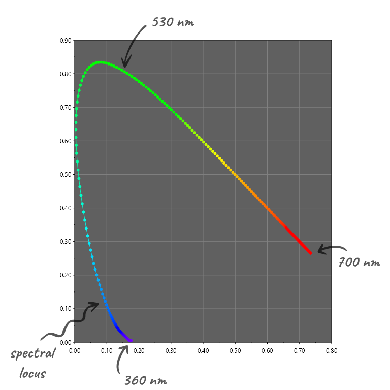
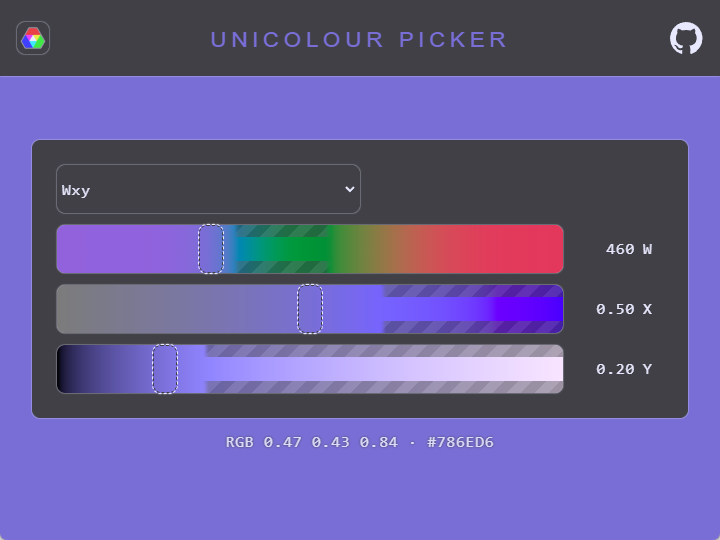

#  Unicolour ❯ WXY color space

WXY is a color space I put together to enable working with color 
in terms of wavelengths and nanometers instead of hues and degrees.

The WXY color space is composed of:
- Dominant wavelength `W`
- Excitation purity `X`
- Relative luminance `Y`

While the concepts themselves are not new _(see Helmholtz coordinates)_,
I'm not aware of them being used in this kind of color space format.

WXY is fully implemented in [Unicolour](https://github.com/waacton/Unicolour),
allowing it to be converted to and from any other color space, interpolated, and compared.

For example, it is trivial to take a WXY color and convert it to [RGB](https://en.wikipedia.org/wiki/RGB_color_spaces),
the modern [Oklab & Oklch](https://bottosson.github.io/posts/oklab/) now available in CSS,
Google's [HCT](https://material.io/blog/science-of-color-design) color system,
or more obscure and specialized color spaces like [TSL](https://doi.org/10.1109/AFGR.2000.840612)
and [XYB](https://ds.jpeg.org/whitepapers/jpeg-xl-whitepaper.pdf).

```c#
var yellow = new Unicolour(ColourSpace.Wxy, 570, 0.75, 0.9);
Console.WriteLine(yellow.Rgb);   // 0.97 0.99 0.19
Console.WriteLine(yellow.Oklab); // 0.96 -0.07 +0.19
```

## ⏪ Background

WXY is based on the [CIE xyY](https://en.wikipedia.org/wiki/CIE_1931_color_space#CIE_xy_chromaticity_diagram_and_the_CIE_xyY_color_space) color space
but, instead of "colorfulness" being defined by the xy-chromaticity coordinates,
it is defined relative to the spectral locus in terms of wavelength and purity.

The spectral locus is the horseshoe-shaped curve on the xy-chromaticity diagram.
It is created by plotting the xy-chromaticity of wavelengths across the visible spectrum,
and represents pure monochromatic light.

Wavelength and purity are calculated by finding where the 
line from the white point to a chosen chromaticity intersects the spectral locus.

This example shows a sample chromaticity that 
intersects the spectral locus at 530 nm (dominant wavelength `W`) 
and is 50% along the line from the white point (excitation purity `X`).


Chromaticities in the purple region do not lie between the white point and the spectral locus,
and instead intersect the "line of purples". Colors along this boundary are non-spectral, 
meaning they cannot be generated by monochromatic light. In this case the opposite intersect, 
known as the complementary wavelength, is used, but with a negative value.

This example shows a sample chromaticity inside the purple region that
intersects the spectral locus at 530 nm (complementary wavelength) so becomes -530 nm (dominant wavelength `W`)
and is 75% along the line from the white point (excitation purity `X`).


Monitors can only display a subset of visible colors.
The gamut of colors available is determined by the RGB model,
such as sRGB, Display P3, Rec. 2020, etc.

This example demonstrates how sRGB green (0, 1, 0), assuming standard illuminant D65 (2° observer),
converts to a wavelength of 549.1 nm and a purity of 73.4%.


The full WXY value is (549.1, 0.7344, 0.7152).

```c#
var green = new Unicolour(ColourSpace.Rgb, 0, 1, 0);
Console.WriteLine(green.Wxy); // 549.1nm 73.4% 0.7152
```

## 🔁 Conversion

The steps to convert between xyY and WXY are deceptively straightforward.

Forward transform from xyY to WXY:
1. Draw a line through `(x, y)` and the white point
2. Find where the line intersects the boundary
3. If `(x, y)` is between the white point and the spectral locus, `W` = spectral locus intersect
4. If `(x, y)` is between the white point and the line of purples, `W` = -(spectral locus intersect)
5. `X` = white point to `(x, y)` distance / white point to boundary distance
6. `Y` = `Y` from xyY

Reverse transform to xyY from WXY:
1. Find the pure chromaticity of `W`
2. Draw a line through `W` and the white point
3. `(x, y)` = the chromaticity that lies `X`% along the line starting from the white point
4. `Y` = `Y` from WXY

The difficulties here are:
- the boundary doesn't have a mathematical definition and is most easily expressed as a polygon
- the number of vertices of the polygon determines the accuracy of the calculations
- each vertex requires computing XYZ tristimulus values from a spectral power distribution
- computing XYZ from spectral data involves using color matching functions (CMFs) of specific observers
- chromaticities converge at each end of the spectral locus, making wavelengths beyond a certain range impossible to distinguish
- many edge cases, such as imaginary colors and white points (colours outwith the boundary)

Unicolour constructs the spectral locus as 1 nm segments
since that is the granularity of the [CIE color matching functions datasets](https://cie.co.at/data-tables?combine=colour-matching+functions%2C),
ranging from 360 nm to 700 nm because beyond that roundtrip conversions became unreliable.



## 🔀 Interpolation

Dominant wavelength can be considered cyclical like hue -
starting at violet, following the spectral locus will lead to red,
and following the non-spectral line of purples will lead back to violet.

However, the wavelength range of the line of purples is determined by the white point,
so how to interpolate between wavelengths is open to interpretation.
Using the standard illuminant D65 (2° observer) white point,
the full range of wavelengths is [360 nm, 700 nm] ∪ [-493.3 nm, -566.4 nm].


I've implemented this in Unicolour in a way that I feel is natural and intuitive,
where the spectral locus is mapped to [0°, 180°] and the line of purples is mapped to [180°, 360°].
Degrees can then be interpolated in the same way as hue.


The main downside is that half of the interpolation space is reserved for purples,
but WXY is not concerned with hue linearity or perceptual uniformity,
only the ability to make working with wavelengths more accessible.

With a notion of interpolation in place, WXY can easily be used in a color picker
as seen in [this online demo](https://unicolour.wacton.xyz/colour-picker/).



## ⏏️ Gamut mapping

Note in the image above that some parts of the sliders show a pattern instead of solid colors.
This is my way of visualizing that those colors cannot be displayed with sRGB because they are out of gamut.


WXY provides an instinctive method of mapping an out-of-gamut color to an in-gamut color:
simply reduce the purity until the color is in gamut. The result will be a color
of the original wavelength and luminance, with the maximum displayable purity.


Purity-reduction gamut mapping is [available in Unicolour](https://github.com/waacton/Unicolour#map-color-into-gamut).
A basic implementation can be achieved with only a few lines of code.

```c#
const double decrement = 0.05; // reduce for greater accuracy

var (w, x, y) = (530, 0.5, 0.7);
var color = new Unicolour(ColourSpace.Wxy, w, x, y);
while (!color.IsInRgbGamut)
{
    x -= decrement;
    color = new Unicolour(ColourSpace.Wxy, w, x, y);
}

Console.WriteLine(color.Wxy); // 530.0nm 30.0% 0.7000
Console.WriteLine(color.Hex); // #0FF993
```

Here is a quick comparison of how different gamut mapping techniques handle
full-purity wavelength at 0.5 luminance. On the left is basic RGB clipping,
in the middle the Oklch-based mapping from the CSS specification,
and on the right the purity-reduction method described above.


---

[Wacton.Unicolour](https://github.com/waacton/Unicolour) is licensed under the [MIT License](https://choosealicense.com/licenses/mit/), copyright © 2022-2025 William Acton.

Also available in [British](wxy-colour-space.md) 🇬🇧.